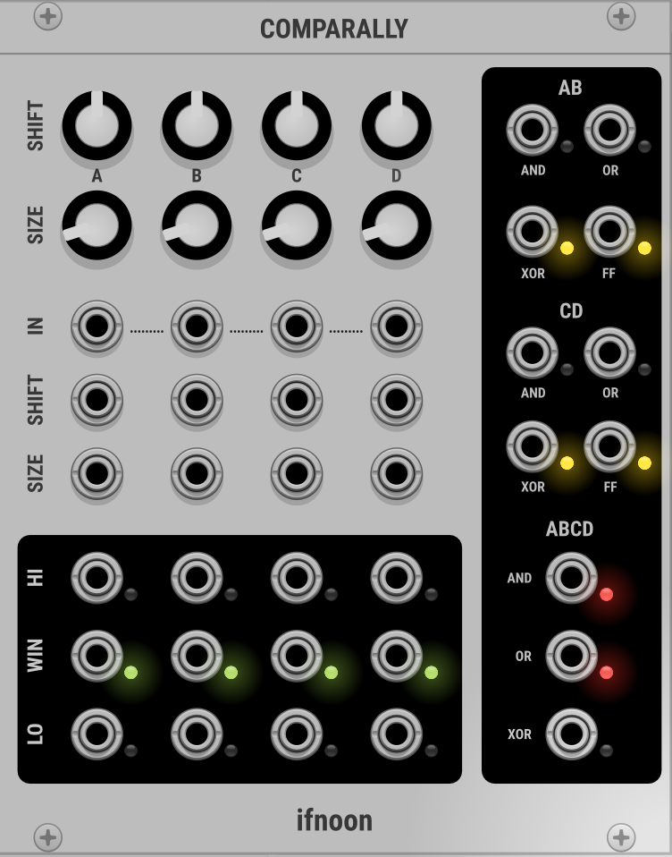

# ifnoon

## Comparally - Advanced 4-Channel Window Comparator

Comparally is a sophisticated 4-channel window comparator with logic outputs for complex signal analysis and conditional routing in VCV Rack.

### Overview
Each channel (A, B, C, D) compares an input signal against a configurable voltage window, outputting three states: above window (HI), inside window (WIN), or below window (LO). The module also provides extensive logic operations between channels and pairs.

### Controls

#### Per-Channel Controls
- **Shift Knob** (±5V): Sets the center of the comparison window
- **Size Knob** (0-10V): Sets the width of the comparison window
- **Shift CV**: CV input to modulate the window center
- **Size CV**: CV input to modulate the window width

#### Input Normalization
- Channel A: Requires input connection
- Channel B: Normalizes to Channel A if no input connected
- Channel C: Normalizes to Channel B if no input connected  
- Channel D: Normalizes to Channel C if no input connected

### Outputs

#### Per-Channel Outputs (A, B, C, D)
- **HI** (Red LED): 10V gate when input is above the window
- **WIN** (Green LED): 10V gate when input is inside the window
- **LO** (Blue LED): 10V gate when input is below the window

#### Pair Logic Outputs (A+B and C+D)
- **AND** (Yellow LED): 10V when both channels are in WIN state
- **OR** (Yellow LED): 10V when either channel is in WIN state
- **XOR** (Yellow LED): 10V when exactly one channel is in WIN state
- **Flip-Flop** (Yellow LED): Toggles state on XOR rising edge

#### Combined Pairs Logic
- **Pairs AND** (Red LED): 10V when both A+B and C+D pairs are active
- **Pairs OR** (Red LED): 10V when either A+B or C+D pair is active
- **Pairs XOR** (Red LED): 10V when exactly one pair is active

### Use Cases
- **Conditional Routing**: Use WIN outputs to trigger events when signals are in specific ranges
- **Signal Analysis**: Monitor multiple signals simultaneously with visual feedback
- **Logic Operations**: Combine multiple conditions using the extensive logic outputs
- **Sequencing**: Use Flip-Flop outputs for state-based sequencing
- **CV Processing**: Convert continuous CV into discrete gate patterns
